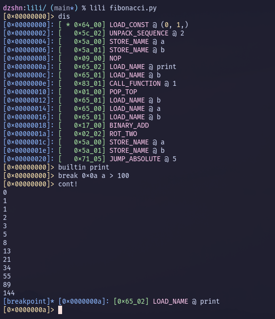

# lili: tiny python bytecode debugger and emulator



## Roadmap

- [ ] Backwards bytecode compatibility
    - [ ] Translate deleted opcodes, figure out what to do with conflicts
    - [ ] Patch `marshal`led data with missing `code` attributes
        - [x] `co_posonlyargcount`
        - [ ] ??
    - [x] Handle pre-3.6a2 opcodes (silly non fixed-width)
- [ ] Handle `EXTENDED_ARG`
- [ ] All 'em opcodes!! (47 of 127 for 3.10)
- [ ] Macros
- [ ] Document things (´；ω；\`)

## Install

Install with pip: (only requires python >= 3.9)

```sh
$ pip install git+https://github.com/dzshn/lili
# or `py -m pip` etc
```

## Usage

Invoking `lili` will start an interactive session. Available commands are
documented in the section below.

```sh
$ lili file  # compile and debug script
$ lili file cmd1 cmd2 .. cmd3  # automatically run commands (will still start session)
```

## Commands

The following commands are recognised by `lili`. Text enclosed in `[]` is
optional (including in the command names). Arguments expecting integers may use
hex, octal or binary with their respective prefixes (`0xc382f`, `0o777`,
`0b10001111`). Any other expression will be evaluated as python code, outside
of the actual program being debugged. The variables `vm`, `code`, `stack`,
`locals`, `globals` and `builtins` are exposed for you to use.

The `step` and `cont` commands will not execute opcodes with side effects not
constrained to the VM's scopes and stack: `DUP_TOP` is fine, `CALL_FUNCTION`
isn't. The `!` forms (`step!`, `cont!`) *will* execute these. You can also use
the `allow` command to control when this happens.

**`a[llow] opcode [condition]`**

Mark an opcode as safe.

**`b[reak] location [condition]`**

Toggle a breakpoint at location.

If a condition is given, the breakpoint will only trigger if it evaluates to true.

**Example:** `break 0x4c x > 128`

**`builtin [names..]`**

Insert a builtin into the VM's builtins.

The `builtins` scope is treated like `globals`, but can't be assigned.

**`[cal]l [argc]`**

Call function and drop into it's frame.

**`c[ont]`**

Step over instructions until a breakpoint is reached.

Only executes opcodes with no side effects. (see `cont!`)

**`cont!, c!`**

Like cont, but unsafe. May execute opcodes with side effects.

**`d[is] [obj]`**

Disassemble and display a function or object's bytecode.

**`disallow [opcodes..]`**

Unmark an opcode as safe.

**`h[elp], ? [query]`**

Display help about debugger commands.

**Example:** `help cont!`

**`i[ncr] [count]`**

Increment the instruction counter.

**Note:** count is the opcode count, not bytes.

**`[inf]o [obj]`**

Display info about the code and the VM.

**`pop [indices..]`**

Pop and discard a value from the stack.

**`push expr`**

Push a value into the stack.

**`q[uit], bye, exit`**

Exit the debugger.

**`r[eturn]`**

Push top of stack into outer frame and pop the current frame.

**`stack, ps`**

Display the current stack.

**`s[tep] times`**

Step over the next instruction.

Only opcodes with no side effects are executed. (see `step!`)

**`step!, s! times`**

Like step, but unsafe. May execute opcodes with side effects.

**`w[here]`**

Display the current call stack and positions.
